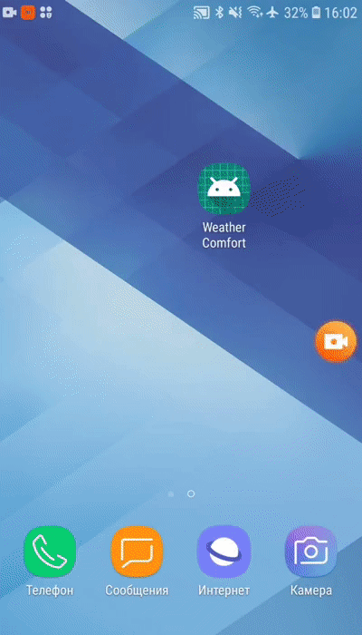

# WeatherComfort

A simple Weather app built to learn how to write Clean Architecture code by solid principles.

## Introduction

  This project was written by solid principles of Clean Architecture and divided into three layers:
  
  1. Data layer contains Local Storage, APIs, Data objects (Request/Response object, DB objects), and the repository implementation.
  
  2. Domain layer contains UseCases, Domain Objects/Models (Pojos/Kotlin Data Classes), and Repository Interfaces.
  
  3. Presentation layer contains UI, View Objects, Android components, etc. This layer implemented MVVM and used Koin for dependency injection.
  
  

## Libraries used

* [Retrofit](https://square.github.io/retrofit/) - A type-safe HTTP client for Android and Java
* [Okhttp](http://square.github.io/okhttp/) - An HTTP client for Android, Kotlin, and Java 
* [Kotlin Coroutines](https://developer.android.com/kotlin/coroutines) - A concurrency design pattern 
* [Navigation Component](https://developer.android.com/guide/navigation/navigation-getting-started) -  A component that helps to navigate between fragments and activities 
* [Koin](https://github.com/InsertKoinIO/koin) - a pragmatic lightweight dependency injection framework for Kotlin


### Api Reference
Used AccuWeather Api to fetch datas:
1. Geoposition Search by GeoPosition (Latitude and Longitude) to get the locationKey.
2. Get 12 Hours of Hourly Forecasts by locationKey.
3. Get 5 Days of Daily Forecasts by locationKey.

To use this project you need to create account and get your own Api Key.
```
API_KEY = "xxxxxxxxxxxxxxxxxxxxxxxxxxxxxxxx"
```
https://developer.accuweather.com/accuweather-forecast-api/apis


## License

This project is licensed under the MIT License - see the [LICENSE](LICENSE) file for details

